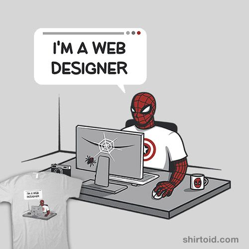

    

## 🔗 Links:

## Sobre Mi 

¡Hola! Me llamo Carlos, apasionado por la programación.

Me motiva aprender cada vez más, me apasiona el desarollo, he imaginar y luego programar algo en diferentes lenguajes como Python y JavaScript

Mi objetivo principal es aprender tecnologías que me permitan desenvolverme profesionalmente como desarrollador de software.

## 🌐 Socials:
 

# 📊 GitHub Stats:

---
